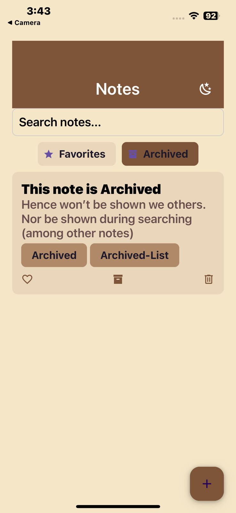
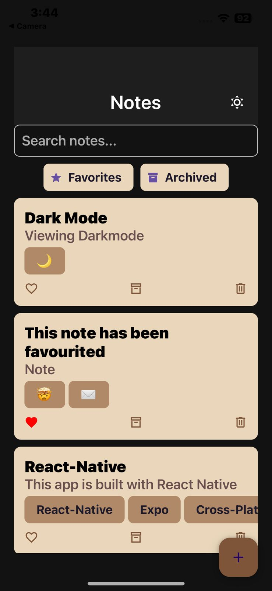
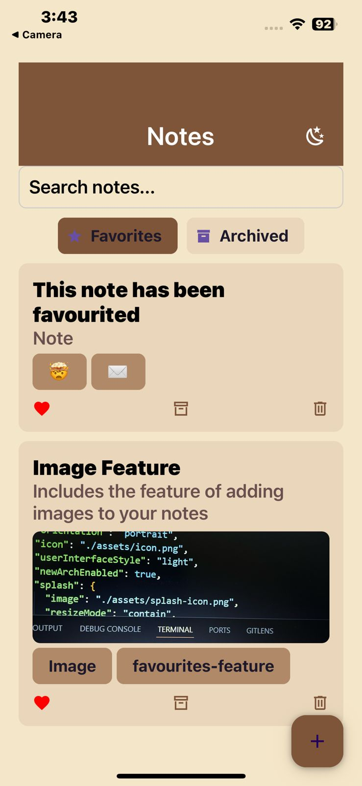
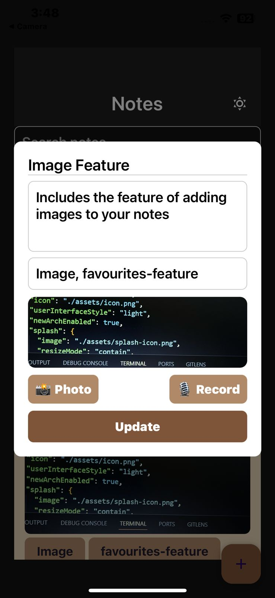
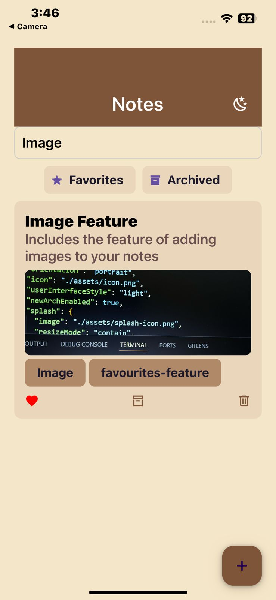
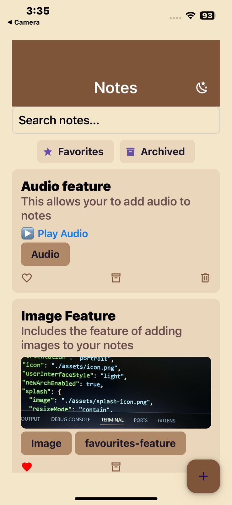

#  NotesApp

NotesApp is a **React Native mobile application** built using **Expo** for creating and managing notes.  
It provides a simple and intuitive interface with features like **dark mode, audio notes, image support, search, favorites, and archiving**.  

---

##  Project Objective
The goal of this project is to build a fully functional **notes-taking app** in **React Native** that demonstrates:
- State management
- Navigation between screens
- Integration of device features (camera, microphone, storage)
- Clean UI design
- Local data persistence

---

##  Features
 Create, edit, and delete notes  
 Dark mode support  
 Search and filter notes  
 Mark notes as **favorites**  
 Archive notes to declutter  
 Add **photos** from camera/gallery  
 Record and play **audio notes**  
 Data saved locally with **AsyncStorage**  

---

##  Tools & Technologies
- **React Native** (Expo Framework)  
- **Expo Go** for running on devices  
- **AsyncStorage** for local storage  
- **React Navigation** for screen navigation  

---

##  App Preview
---

| Home / Archive | Dark Mode | Favorites | Update Notes |
|----------------|-----------|-----------|--------------|
|  |  |  |  |

| Search Notes | Audio Notes | Image Notes |  
|--------------|-------------|-------------|  
|  |  |  |  

